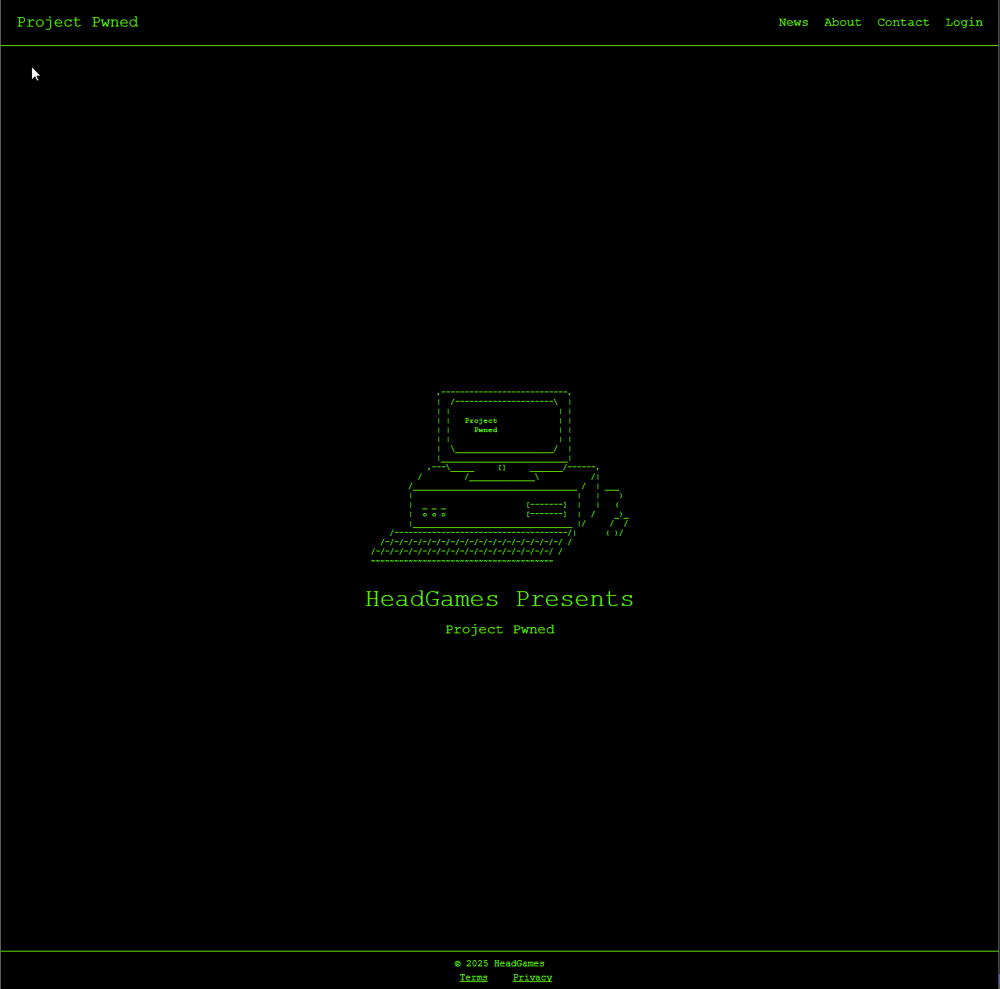

# Project Pwned



Project Pwned is the start of a mobile & web application I'm working on. 
The initial project is to build the features below.

## 🚀 Features

- 🔐 User authentication (sign up, login, logout) using Supabase
- 👤 Profile management and account deletion with a 14-day grace period
- 🔁 Password reset with confirmation and cooldown protection
- 🧾 ASCII-art infused terminal UI for immersive experience
- ⚙️ Settings section with password change and account termination
- 📄 Informational pages: About, Contact, News
- 🧩 Future plans include full game mechanics

## 🔧 Tech Stack

- [React Native](https://reactnative.dev/)
- [Expo Router](https://expo.dev/router)
- [Supabase](https://supabase.com/) (Auth + DB)
- TypeScript

## 🗂️ Folder Structure

```
/app
  /settings
    change-password.tsx
    profile.tsx
    account.tsx
  /components
  /lib
  /context
  _layout.tsx
  login.tsx
  signup.tsx
  profile.tsx
  create-profile.tsx
  reset-password.tsx
  reset-password-confirm.tsx
  reactivate.tsx
  about.tsx
  contact.tsx
  news.tsx
.env
```

## 📦 Setup Instructions

1. **Clone the repository**
   ```bash
   git clone https://github.com/your-username/project-pwned.git
   cd project-pwned
   ```

2. **Install dependencies**
   ```bash
   npm install
   ```

3. **Set up your environment variables**
   Create a `.env` file:
   ```bash
   cp .env.example .env
   ```

4. **Start the project**
   ```bash
   npx expo start
   ```

## 📁 Environment Variables

Example `.env`:
```
EXPO_PUBLIC_SUPABASE_URL=https://xyzcompany.supabase.co
EXPO_PUBLIC_SUPABASE_ANON_KEY=your-anon-key-here
```

These are public keys and safe to expose in the client. Do not include service_role keys here.

## 🛡️ Security Notes

- Supabase Row-Level Security (RLS) is enabled on critical tables
- Marked-for-deletion logic ensures accounts are not accessible during pending deletion
- Password reset and deletion features include cooldown logic to prevent abuse

## 📄 License

MIT

---

Built by Robert Head as a learning project & proof of concept.
